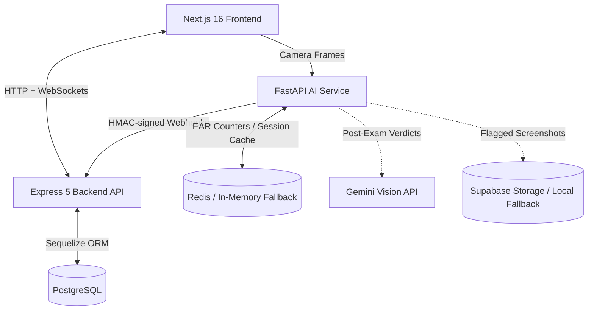

# ExamProctorAI 🛡️

**ExamProctorAI** is a full-stack, AI-powered online examination platform built to preserve academic integrity. It combines real-time computer vision (face, gaze, and blink detection), strict browser lockdown enforcement, live examiner alerts, and automated post-exam reviews powered by **Gemini Vision** — all in one microservices-based system.

Works fully offline out of the box (local storage + in-memory cache), with optional cloud integrations for Redis, Supabase Storage, and hosted PostgreSQL.

---

## 🏗️ Architecture Overview



| Service | Stack | Port | Path |
|---|---|---|---|
| Frontend | Next.js 16 (App Router), React 19, Tailwind CSS 4 | `3000` | [frontend/](frontend/) |
| Backend API | Node.js, Express 5, Sequelize, Socket.io | `3001` | [backend/](backend/) |
| AI Service | Python, FastAPI, OpenCV, MediaPipe | `8000` | [ai-service/](ai-service/) |
| Database | PostgreSQL 15 | `5432` | — |
| Cache | Redis 7 (optional) | `6379` | — |

### Frontend — [frontend/](frontend/)
Next.js App Router client with pages for **registration**, **login**, the **student exam room** ([frontend/app/exam/](frontend/app/exam/)), and the **examiner dashboard** ([frontend/app/dashboard/](frontend/app/dashboard/)). It captures webcam frames, enforces fullscreen and whole-desktop screen sharing, intercepts browser/keyboard events, and streams violations in real time.

### Backend — [backend/](backend/)
The central orchestrator ([backend/server.js](backend/server.js)):
- **Auth & roles** (`student`, `examiner`) via JWT — [backend/routes/auth.js](backend/routes/auth.js)
- **Exam & submission management** — [backend/routes/exam.js](backend/routes/exam.js)
- **Proctoring flags ingestion** with HMAC-SHA256 webhook signature verification and rate limiting — [backend/routes/proctor.js](backend/routes/proctor.js)
- **Live alerts** pushed to the examiner dashboard via Socket.io — [backend/socket.js](backend/socket.js)
- Sequelize models: [User](backend/models/User.js), [Exam](backend/models/Exam.js), [Submission](backend/models/Submission.js), [Flag](backend/models/Flag.js)

### AI Service — [ai-service/](ai-service/)
FastAPI service ([ai-service/app.py](ai-service/app.py)) running local inference on incoming frames:
- **Face detection** — Caffe SSD detector ([ai-service/core/detector.py](ai-service/core/detector.py))
- **Blink analysis** — Eye Aspect Ratio counters ([ai-service/core/ear.py](ai-service/core/ear.py))
- **Gaze & head-pose estimation** — MediaPipe Iris landmarks ([ai-service/core/gaze.py](ai-service/core/gaze.py))
- **Flagging pipeline** — screenshot capture + webhook dispatch ([ai-service/core/flagging.py](ai-service/core/flagging.py))
- **Post-exam AI review** — Gemini Vision verdicts ([ai-service/review.py](ai-service/review.py))

---

## 🌟 Features

### 👨‍🎓 Student Exam Session
Camera access and full-desktop screen sharing are mandatory to begin, and a compliance consent screen is shown at exam start. During the session the following are detected and flagged live:

| Category | Flags |
|---|---|
| **Vision** | `NO_FACE`, `MULTIPLE_FACES`, `EYES_CLOSED` (prolonged EAR), `GAZE_LEFT` / `GAZE_RIGHT` |
| **Browser activity** | `TAB_SWITCH`, `WINDOW_BLUR`, `FULLSCREEN_EXIT`, `DEVTOOLS_OPENED` |
| **Input blocking** | `CLIPBOARD_ACTION` (copy/cut/paste/right-click), `SHORTCUT_BLOCKED` / `META_KEY_PRESS` (F12, print, view-source, OS shortcuts) |
| **Screen sharing** | Whole-desktop enforcement — single window/tab sharing is rejected |

### 👩‍🏫 Examiner Dashboard
- **Live alert stream** — violations appear instantly via WebSockets.
- **Session audit timeline** — timestamps, flag details, and webcam snapshot overlays per student.
- **Gemini post-exam review** — after a student finishes, flagged screenshots + telemetry are sent to Gemini Vision, which returns a verdict per incident:
  - 🔴 `HIGH_RISK` — clear, deliberate cheating (second person visible, sustained off-screen looking)
  - 🟡 `SUSPICIOUS` — ambiguous; needs human review
  - 🟢 `FALSE_ALARM` — safe trigger (normal blink, brief misalignment)

### 🔒 Security & Reliability
- HMAC-SHA256 signature verification on all AI-service → backend webhooks (raw-body signing).
- Rate limiting with trust-proxy configuration on backend endpoints.
- Private Supabase storage with temporary **signed URLs** for screenshot access.
- Graceful fallbacks: in-memory cache when Redis is absent; local file storage ([ai-service/flags/](ai-service/flags/)) when Supabase is unconfigured.
- Service prewarming with retry/cooldown to avoid cold starts on hosted deployments.

---

## ⚙️ Configuration

All variables are documented in [.env.example](.env.example). Split them into `backend/.env`, `frontend/.env.local`, and `ai-service/.env` as indicated in that file.

| Variable | Service | Purpose |
|---|---|---|
| `JWT_SECRET` | backend | Signing session tokens |
| `WEBHOOK_SECRET` | backend + ai-service | Shared HMAC secret for webhook verification |
| `AI_SERVICE_URL` / `FRONTEND_URL` | backend | Service URLs |
| `DATABASE_URL` or `DB_HOST`/`DB_PORT`/`DB_NAME`/`DB_USER`/`DB_PASSWORD` | backend | PostgreSQL connection (connection string supports cloud DBs like Neon/Supabase with SSL) |
| `NEXT_PUBLIC_BACKEND_URL` | frontend | Backend API base URL |
| `GEMINI_API_KEY` | ai-service | Gemini Vision post-exam reviews |
| `REDIS_URL` or `REDIS_HOST`/`REDIS_PORT` | ai-service | Redis cache (optional — falls back to in-memory) |
| `SUPABASE_URL` / `SUPABASE_KEY` / `SUPABASE_BUCKET` | backend + ai-service | Cloud screenshot storage (optional — falls back to local files) |

> [!TIP]
> Only `JWT_SECRET`, `WEBHOOK_SECRET`, and database credentials are strictly required to run locally. Redis, Supabase, and Gemini are optional add-ons.

---

## 🚀 Getting Started

### Option A — Docker Compose (recommended)
Spins up PostgreSQL, Redis, the backend, and the AI service:

```bash
# 1. Configure environment variables (copy .env.example as a template)
docker-compose up --build

# 2. Run the frontend separately
cd frontend
npm install
npm run dev
```

Open [http://localhost:3000](http://localhost:3000).

### Option B — Manual setup

**1. Database & cache**
- Local PostgreSQL with a database named `exam_proctor`
- Local Redis (optional)

**2. Backend**
```bash
cd backend
npm install
npm run dev        # nodemon; syncs schema on startup → http://localhost:3001
```

**3. AI service**
```bash
cd ai-service
python -m venv venv
source venv/bin/activate   # Windows: .\venv\Scripts\activate
pip install -r requirements.txt
uvicorn app:app --host 0.0.0.0 --port 8000
```

**4. Frontend**
```bash
cd frontend
npm install
npm run dev        # http://localhost:3000
```

---

## 🧪 Testing

```bash
# AI service unit tests (EAR blink thresholds, MediaPipe gaze calculations)
cd ai-service && pytest

# Backend integration tests (Jest + Supertest — proctor webhook/HMAC route)
cd backend && npm test
```

---

## 📁 Project Structure

```
Exam_Proctor/
  ├── frontend/          # Next.js 16 client (exam room, dashboard, auth pages)
  ├── backend/           # Express 5 API (routes, Sequelize models, Socket.io)
  ├── ai-service/        # FastAPI vision service (detector, EAR, gaze, flagging, Gemini review)
  ├── scripts/           # Utility scripts
  ├── docker-compose.yml # PostgreSQL + Redis + backend + AI service
  └── .env.example       # All environment variables, grouped by service
```

---

## 🔮 Roadmap
- **Audio anomaly monitoring** — detect background voices/noise via Web Audio API.
- **Lockdown browser integration** — prevent window minimizing entirely.
- **Behavioral threat scoring** — aggregate minor flags into dynamic session risk levels.
- **LMS webhook notifications** — notify external learning management systems on session completion.
